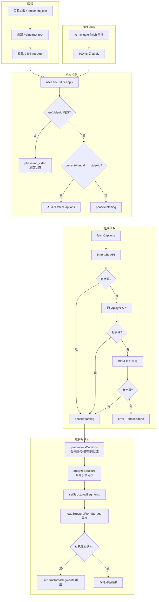
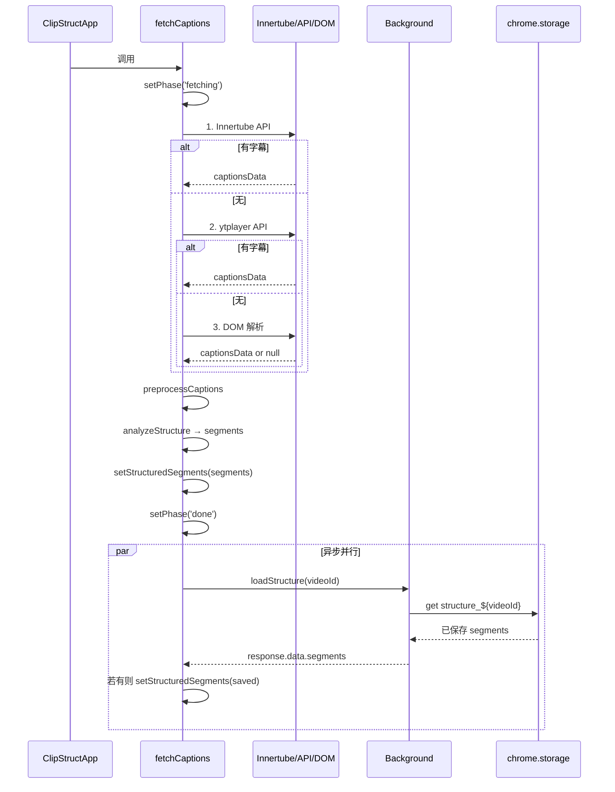
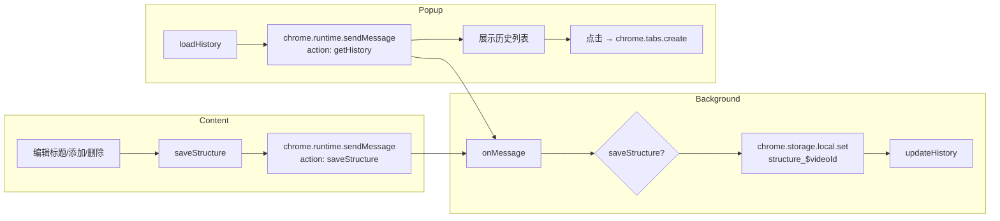

# ClipStruct 实现逻辑与流程图

## 一、整体架构

```
┌─────────────────┐     chrome.runtime.sendMessage      ┌──────────────────┐
│   Popup (UI)    │ ──────────────────────────────────► │   Background     │
│  popup.jsx      │ ◄────────────────────────────────── │  (Service Worker)│
└─────────────────┘     chrome.storage.local            └────────┬─────────┘
        │                                                        │
        │ 用户点击历史打开新 Tab                                   │ 存储/读取
        ▼                                                        │
┌─────────────────┐     chrome.runtime.sendMessage               │
│  YouTube 页面   │ ◄────────────────────────────────────────────┘
│  Content Script │ ────────────────────────────────────────────►
│  content.jsx    │     saveStructure / loadStructure
└─────────────────┘
```

**三个入口：**
- **manifest** → content_scripts 注入 content.jsx 到 `youtube.com/*`
- **manifest** → action.default_popup 指向 popup.html
- **manifest** → background.service_worker 运行 background.js

---

## 二、Content Script 主流程（content.jsx）



---

## 三、fetchCaptions 内部流程



---

## 四、存储与消息流



---

## 五、当前流程中的问题

### 1. 已保存结构的加载顺序

**现状：** 先 `analyzeStructure` 并 `setStructuredSegments`，再异步 `loadStructureFromStorage`，若有则覆盖。

**问题：** 会短暂显示分析结果，再被已保存结构替换，存在闪烁。且语义上「优先恢复」应在一开始就决定用分析还是已保存。

**建议：** 先 `loadStructureFromStorage`，有则直接使用，无则再 `analyzeStructure` 并展示。

---

### 2. Popup 设置未被使用

**现状：** `autoAnalyze`、`showCaptions` 存入 `chrome.storage.local.settings`，但 content script 从未读取。

**问题：** 设置无效，属于未闭环的逻辑。

---

### 3. useEffect 闭包中的 videoId

**现状：** `useEffect` 依赖为 `[]`，内部 `apply` 使用的 `videoId` 始终为初始值 `''`。

**结果：** 首次进入有效视频页时 `currentVideoId !== ''` 恒为 true，会触发 `fetchCaptions`。但后续 SPA 导航时，无法正确判断「是否已切换到不同视频」，可能重复拉取或漏拉取。

**建议：** 使用 `useRef` 保存上一次 `videoId`，或在 effect 中通过 `getVideoId()` 与本地存储/状态对比，避免依赖闭包中的 stale `videoId`。

---

### 4. phase 初始值与初次检测

**现状：** `phase` 初始为 `'checking'`，但 `apply` 中仅设置为 `'no_video'` 或 `'fetching'`，从未显式设为 `'checking'`。

**结果：** 仅在组件首次渲染时为 `'checking'`，`apply()` 执行后立刻变为 `'fetching'` 或 `'no_video'`，可能只出现一瞬间，但逻辑上不够清晰。

---

### 5. Background 的 tabs.onUpdated 未生效

**现状：** `tabs.onUpdated` 监听到 YouTube 视频页加载完成，但只打日志，未向 content script 发送消息。

**影响：** 若 content script 未及时注入或初始化，无法通过 background 主动触发分析。当前完全依赖 content_scripts 的 `run_at: document_idle`。

---

## 六、数据流小结

| 数据 | 来源 | 去向 |
|------|------|------|
| 字幕原始数据 | Innertube API / ytplayer / DOM | preprocessCaptions → analyzeStructure |
| 结构段 segments | analyzeStructure 或 loadStructure | UI 展示 + saveStructure |
| 已保存结构 | chrome.storage | loadStructureFromStorage → setStructuredSegments |
| 分析历史 | updateHistory 写入 | getHistory → Popup 展示 |
| 设置 | Popup 写入 | **未在 content 中读取** |

---

## 七、核心文件职责

| 文件 | 职责 |
|------|------|
| content.jsx | 注入到 YouTube 页，获取字幕、分析结构、展示 UI、编辑结构、保存 |
| background.js | 消息路由、存储读写、历史管理 |
| popup.jsx | 设置、历史列表、打开视频页 |

---

## 八、PRD 符合性（仅核心流程 / MVP）

对照 `.trae/documents/PRD.md`，**只关注核心流程**，结论如下。

### 8.1 已满足（核心闭环）

| PRD 要求 | 当前实现 |
|----------|----------|
| 打开 YouTube 视频页 → 自动检测视频与字幕 | ✓ useEffect 取 videoId，自动 fetchCaptions |
| 右侧结构分析面板 | ✓ clipstruct-panel |
| 当前结构段高亮 + 时间轴同步 | ✓ currentTime + segment.start/end，segment-current |
| 点击时间轴跳转 | ✓ handleSegmentClick → video.currentTime |
| 手动标注/调整（编辑标题、添加/删除段） | ✓ 编辑模式 + saveStructure |
| 本地保存、刷新后保持 | ✓ chrome.storage.local，loadStructureFromStorage 恢复 |
| 字幕获取（前端、带时间戳、中英文） | ✓ Innertube → ytplayer → DOM |
| 文本预处理（合并短句、停用词） | ✓ mergeShortSentences + filterStopWords |
| 无字幕时提示 | ✓ "无法获取视频字幕..." |

### 8.2 与 PRD 有差异（MVP 内建议补齐）

| 项目 | PRD | 当前 | 说明 |
|------|-----|------|------|
| **结构类型** | 7 类：Hook / Background / Core Point / Example / Transition / Emotional Amplification / Call To Action | 3 类：introduction / main / conclusion | 拉片核心是「看懂结构」，7 类更贴合 PRD 与使用流程；MVP 可先做规则+关键词，不做 AI。 |
| **每段意图说明** | 每段需 Intent Description（一句话意图） | 仅有 title，无 intent 字段 | 4.6 要求每段含类型+意图，当前只有标题，意图对拉片价值高。 |
| **导出（Markdown/纯文本）** | 4.8 支持导出 MD + 纯文本 | 未实现 | 验收场景 5 要求可导出，属于 MVP 闭环。 |

### 8.3 可暂不做的（不扩大范围）

- AI 辅助标注（PRD Step 2 可选）
- 面板宽度拖拽、时间轴高度响应式（有默认即可）
- 拖拽结构段边界（可先只做「改标题 + 添加/删除段」）
- 字幕重试 3 次/2 秒、语言不支持单独提示（有「无法获取字幕」即可）
- 存储键名（PRD 写 clipstruct_analysis_{video_id}，当前 structure_${videoId} 功能等价）

### 8.4 核心流程体验结论

- **流程是否通**：通。进入视频页 → 自动拉字幕 → 规则分段 → 展示时间轴 → 高亮/跳转/编辑/保存/恢复 都具备。
- **体验问题**：
  1. **已保存结构**：先展示分析结果再被 storage 覆盖，会闪一下；应先读 storage，无再分析（见第五节）。
  2. **无导出**：无法带走结果，拉片闭环不完整（PRD 明确要求）。
  3. **结构类型与意图**：仅 3 类且无意图，和 PRD「理解内容意图」目标有差距，MVP 建议至少补齐 7 类 + 每段一句意图（可先规则生成占位）。

**结论**：在「只关注核心流程、不扩大需求」前提下，当前实现**基本符合** PRD 主流程与 MVP 验收（字幕、结构、时间轴、本地编辑与保存）；要**完全符合** PRD 且体验稳定，建议 MVP 内只做三件事：**(1) 先读 storage 再分析，避免闪烁；(2) 补齐导出 Markdown/纯文本；(3) 结构 7 类 + 每段意图（可先规则/占位）。** 其余（AI、拖拽边界、重试策略等）可放到后续迭代。
